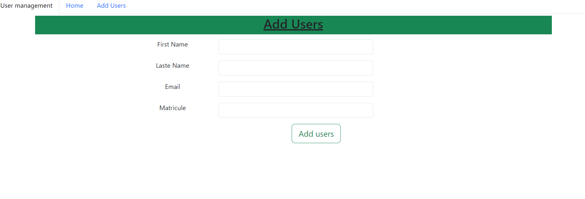
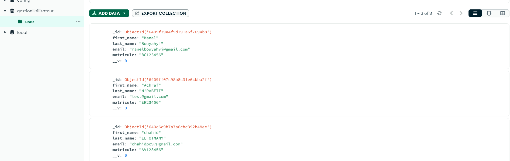
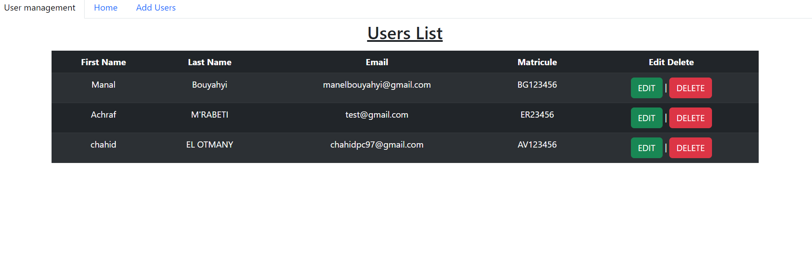
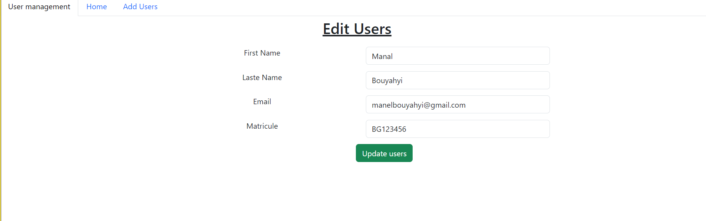

# Project MEAN STACK Master GestionUtilisateur
This project gives the users (add, edit, delete) the users from the list.

team: BOUYAHYI Manal, EL OTMANY Chahid, M'RABETI Achraf.

# Install nodejs

ng install  
npm install --save express mongoose cors body-parser
## Development server

Run `ng serve` for a dev server. Navigate to `http://localhost:4200/`. The app will automatically reload if you change any of the source files.

## Stack 

Angular,
Mongo DB,
Bootstrap,
Nodejs 

## ScreenShot

 
 
 
 

